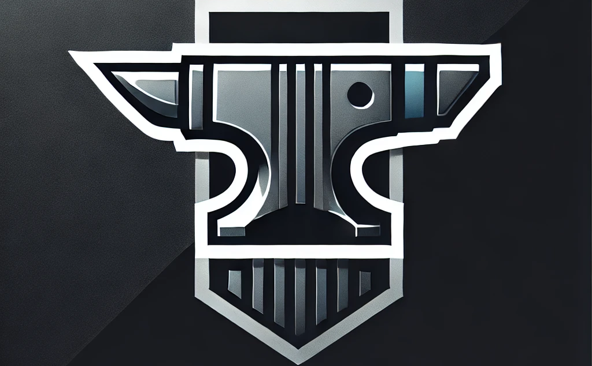

>                         !! WARNING !!
> Anvil is currently in **heavy active development** and undergoing rapid architectural changes. With one active developer
>
> Core systems such as rendering, assets, scene management, and editor tooling are actively being built and refactored.
>
> Expect:
> - Frequent breaking changes
> - Incomplete features
> - Limited documentation
> - APIs changing over time
>
> The project is being developed in the open as both an engine and a learning journey. Contributions, feedback, issue reports, and curious visitors are welcome.

---

# Anvil Engine 
- `Anvil Engine` is built with a powerful, flexible toolset designed to empower developers in creating immersive experiences, whether you're building games, interactive simulations, or lightweight applications. <br> 

- Anvil provides a solid foundation with a range of customizable components
and a versatile renderer that balances performance with simplicity. <br>

- With Anvil, you’ll have the freedom to focus on crafting your vision without unnecessary overhead, thanks to our lightweight, hardware-focused renderer. Our mission is to support developers by offering both high-level tools for rapid development and fine-tuned, API-specific functionality for those who want to dive deeper.

Thank you for choosing Anvil Engine—let’s get started building something incredible!

## Table of contents
1. [Overview](#overview)    
2. [About](#about)
2. [Installation](#installation)
3. [Structure](#structure)
4. [Naming Convention](#naming-convention)
5. [API Documentation](#api-documentation)
6. [Contact](#contact-us)

---

## Overview

Anvil Engine is a modular, developer-friendly engine built for flexibility, offering everything needed to create dynamic applications and games. It’s designed with two primary use cases in mind: high-performance game development and lightweight application development. Anvil’s structure includes a high-level layer of classes that streamline development with intuitive components and a lower-level API-specific layer for developers who need greater control over rendering and functionality.

### Key Features

- **Multi-Window Support**: Manage multiple windows seamlessly for complex applications and dynamic interfaces.
- **Customizable Renderer**: Choose between an optimized hardware renderer for performance-driven applications and a stripped-down version for lightweight projects.
- **Component-Based Architecture**: A library of components provides bare-bones elements for app development without the overhead of a full game-driven renderer.
- **High-Level and Low-Level Access**: High-level tools accelerate your workflow, while lower-level API-specific access gives you the freedom to customize as needed.
- **Built-In GLFW Support**: Integrated GLFW ensures cross-platform compatibility and handles system-level details, so you can focus on what matters most—your application’s functionality and experience.

Anvil Engine is built to serve as a comprehensive toolset that grows with your project. Whether you’re building a game or a simple app, Anvil has the flexibility and power to bring your ideas to life.

## About

Anvil began as a personal experiment and a challenge: learn graphics programming and engine architecture by building systems from the ground up rather than relying on existing engines. What started as simple rendering tests and low-level graphics experiments gradually evolved into a larger goal — creating a modular engine designed to teach, explore, and eventually power real projects.

Early versions focused heavily on understanding graphics APIs and renderer design. As development continued, Anvil went through multiple rewrites, architectural changes, and redesigns. Systems were frequently rebuilt as new lessons were learned. Instead of treating those rewrites as failures, they became part of the process. The project grew alongside its developer.

Today, Anvil is evolving into a modular C++ engine centered around rendering, application development, and flexible architecture. The long-term vision is to support not only games, but also lightweight applications, tools, and educational projects.

The engine is being developed openly and iteratively. Much of the work happens in public: experimentation, mistakes, redesigns, and breakthroughs alike. The goal isn't just to arrive at a finished engine — it's to understand the technology deeply enough to build it intentionally.

Anvil is still in heavy development, and many systems are unfinished or rapidly changing. But every renderer rewrite, bug hunt, and late-night debugging session pushes the project forward.

---
## Installation
Installation is meant to be as simple as possible. 

### Prereq
- `c++20`
- `python 3`
- `Microsoft Visual Studio 2022`
- `Premake5`

1. Clone the dev repository.<br>
```git clone --recursive -b dev https://github.com/AnvilStudio/AnvilWorkspace.git```
2. Navigate to `AnvilWorkspace/ProjectCreator` and run `python3 project_creator.py <Prj Name> <Prj Dir>`.
3. In the root folder (AnvilWorksapce), run in your terminal... <br>
```<your premake installation> vs2022```
4. Open the `AnvilWorkspace.sln` file
5. In Visual Studio, set the `Forge` projects command line arguments to `-prj <path to your project>` (right click the project > Debug > command arguments)
6. Build and run!
    
---

## Structure

Anvil follows a specific file structure known as a `Library/Application` structure.<br>

the files are as follows

```
    AnvilEngine/ (static lib)
        L include/ 
        |    L (client headers)
        L src/ 
        |    | (main library implimentation)
        |    L Core/
        |    |    L High Level code (i.e. - App class, api - agnostic)
        |    L Render/ 
        |    |    | (All high level rendering components + renderer)
        |    |    L Platform/ 
        |    |    |    | (api - specific)
        |    |    |    L Vulkan/ 
        |    |    |    |   L (api implimentation)
        |    |    |    L OtherAPI/
        |    L Util/ 
        |       L (Engine Utility like macros/logging/time)
        L vendor/ 
            L (3rd party libs like GLFW)

        |
        | Engine turns into a static lib for client to use
        |
        V

    Client/
        L src/  
```

---

## Naming Convention

when contributing to Anvil, you MUST follow the naming convention!


#### Tests
- All Tests should start with `tst_`

#### Files
- All File names should be `Upper Camel Case` like so: `MyCppFile.cpp`

#### Macros
- All Macros should start with `ANV_` and `USE_ALL_CAPS_WITH_UNDERS`

#### Global
Avoid using globals
- All global vars should start with `g_` then be `Upper Camel Case`

#### Namespace 
rules only apply if the function is not apart of the `anv` namespace
- All namespace functions should start with the `first 3 letters` of the namespace, underscore, then `Upper Camel Case` for the function name like so:
``` cpp
namespace MyNamespc
{
    int MYN_AddTwoNumbers();
}
```
- All nested namespaces within namespace `anv` should be lowercase

#### Functions
applys to constructors and deconstructors
- All parameter names should have an `underscore` at the beginning and be `Lower Camel Case` like so:
`void MyFn(int _myInt);`

#### Classes
- All Class Names should follow `Upper Camel Case`
- All non static member variables must start with `m_<VarName>`
- All static member variables must start with `s_<StaticVarName>`
- All public and static member Functions/Constructors/Deconstructors must be `Upper Cammel Case` like so: `public void MyFunctionIsGreat();`
- All private member Functions/Constructors/Deconstructors should be `Lower Camel Case with Underscores` like so: `private void my_function_is_great();`

#### Structs
- All Struct names should be `Upper Camel Case` 
- All Members should be `Lower Camel Case` like so: `int myInt;`
- All pointer types should start with a `p` like so: `int* pMyPointer;`
- Fns/Constr/DeConst should all be `Upper Camel Case` 

#### Enums
- All Enum names should be `Upper Camel Case`
- All Enum Values should be `ALL_CAPS_WITH_UNDERS`


---

## API Documentation

under  construction

---

##Future Plans

Anvil's long-term goal extends beyond becoming just another rendering sandbox or game engine. The vision is to build a flexible and approachable platform capable of supporting games, tools, applications, and experimentation while remaining educational and modular at its core.

Planned development areas include:

### Rendering
- Expand the current Vulkan renderer into a fully featured rendering pipeline
- Efficient 2D rendering with batching and texture atlases
- Material and shader systems
- Framebuffer abstractions and post-processing
- Lighting and future 3D rendering support
- Multi-API support beyond Vulkan
### Engine Systems
- ECS-driven scene and entity architecture
- Asset and metadata management
- Serialization and project persistence
- Multithreaded task and render systems
- Resource caching and hot reloading
### Forge Editor

Forge is planned as Anvil's integrated editor environment.

Goals include:

- Project creation tools
- Scene hierarchy and inspectors
- Asset browser
- Drag-and-drop workflows
- Visual debugging and profiling tools
- Multi-window support
### Scripting and Extensibility

Future versions aim to provide scripting support for rapid iteration and game logic development:

- Runtime scripting systems
- User extensibility APIs
- Tool and editor plugins
- Support for experimentation and custom workflows
### Cross Platform Support

Anvil is being designed with portability in mind:

- Windows support
- Linux support
- macOS support
- Mobile (android / ios)
Architecture flexibility for future platforms

## Contact Us

### Head Dev: Cayden "CJ" Jordan
- email: @caydenjordan05@gmail.com 
- instagram: @cj.cpp
